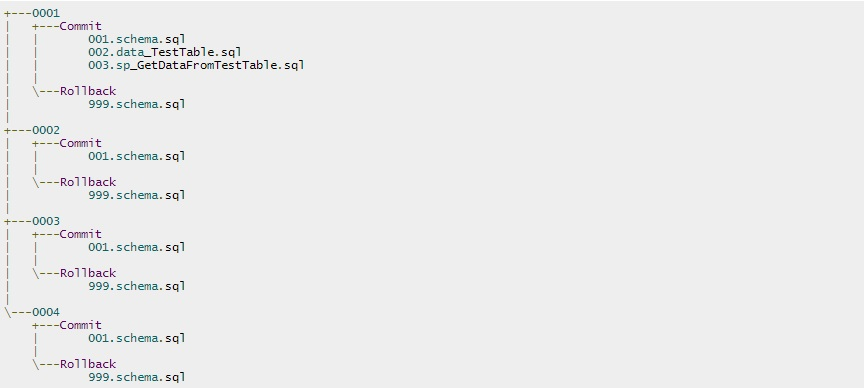
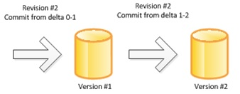
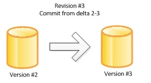
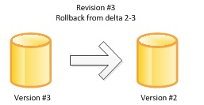

#db-advance
This project is currently forked from [db-advance](https://github.com/slmoloch/db-advance) with some custom modifications designed to work with VS Database Projects (SSDT)

db-advance is a tool to deploy changes to a SQL Server database. db-advance works with a package that is a simple zip file with the contents of the following structure:

Each folder represents deltas with two parts - commit (or install) and rollback. Scripts in the folder are exectured sequentially in alphanumeric order. 

Command line to deploy or upgrade the database:

>db-advance.exe --up --database={database name from connection strings} --version=

It will apply all deltas in the package sequentially as noted below:

Also the same command can be issued against a database to update it to a new version. db-advance maintains the current version of the database in the extended properties so it always knows which changes
are missing from one upgrade to the next:

The changes also can be rolled back with the "rollback" command:

>db-advance.exe --down --database={database name from connection strings}

Rollbacks are executed in each delta all the way from the current version to the base version.

